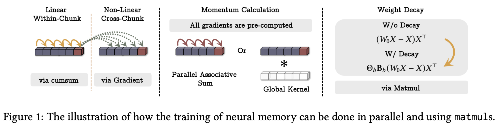

# Titans - JAX/Flax Implementation

This repository provides a JAX/Flax implementation of the **Titans** architecture, a novel approach to long-term memory in neural networks introduced by Google Research.



## Overview: Google Titans Architecture

Titans is designed to bridge the gap between Short-term Memory (Standard Attention) and Long-term Memory (Weights). The core idea is to treat the **Neural Memory** itself as a small, fast-learning neural network (often an MLP or Attention layer) nested within the larger model.

### Key Components:

1.  **Neural Memory as a Service:** Instead of using fixed memory slots or simple hidden states, Titans uses a set of weights that are updated via gradient descent during the forward pass. This allows the model to "learn to remember" and "learn to forget."
2.  **Associative Scan:** To make this process efficient and parallelizable, Titans employs an **associative scan**. This operation allows the sequential update of memory weights to be computed in $O(\log N)$ time instead of $O(N)$, leveraging GPU/TPU parallelism.
3.  **Surprise-based Updates:** The memory is updated based on "surprise" — the gradient of a loss function that measures how well the current memory predicts the new data.
4.  **Adaptive Gating:** The model uses adaptive step sizes (learning rates), momentum, and decay factors to control how information is stored and purged over time.

## Project Realization

This project implements the Titans architecture using **JAX** and **Flax**, optimized for high-performance computation and hardware acceleration.

### Implementation Highlights:

*   **`titans.py`**: Implements the `NeuralMemory` module using a multi-layer perceptron (MLP) as the underlying memory model. It features multi-head memory retrieval and surprise-based weight updates.
*   **`titans_attn_memory.py`**: An alternative implementation where the memory model is a causal Attention layer, allowing for more complex intra-chunk memory relationships.
*   **`associative_scan.py`**: Leverages `jax.lax.associative_scan` for high-performance, parallel memory updates.
*   **Vectorized Gradients**: Uses `jax.vmap` and `jax.grad` to compute per-sample memory updates efficiently within the forward pass.

## Installation

Ensure you have JAX and the required dependencies installed:

```bash
pip install -r requirements.txt
```

## Usage

### MLP-based Neural Memory

```python
import jax
import jax.numpy as jnp
from titans import NeuralMemory

dim = 128
heads = 4
chunk_size = 16

model = NeuralMemory(dim=dim, heads=heads, chunk_size=chunk_size)
rng = jax.random.PRNGKey(0)
x = jax.random.normal(rng, (batch_size, seq_len, dim))

variables = model.init(rng, x)
output = model.apply(variables, x, rngs={'params': rng})
```

### Attention-based Neural Memory

```python
from titans_attn_memory import NeuralMemory as AttnNeuralMemory

model = AttnNeuralMemory(dim=dim, heads=heads, chunk_size=chunk_size)
# Initialization and apply are similar to above
```

## License

This project is licensed under the MIT License - see the [LICENSE](LICENSE) file for details.
